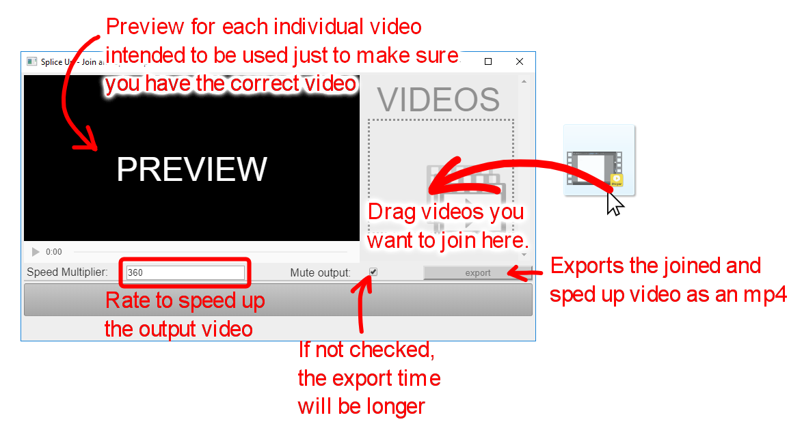
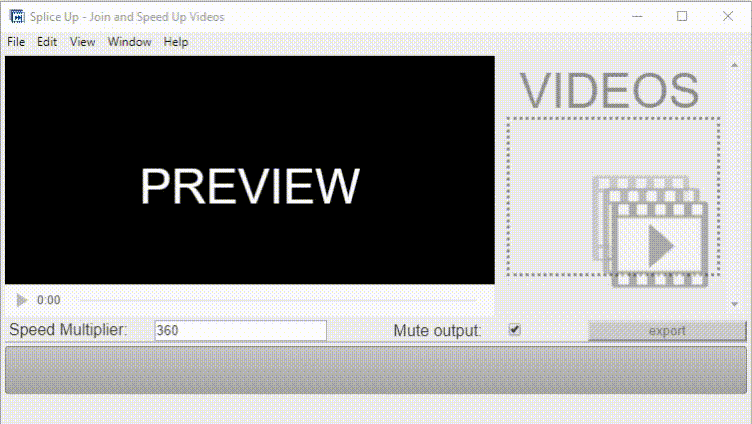

# splice-up
A tool to join videos then speed them up.

### Download 

Go to [releases](../../releases), then download and extract either the Linux or Windows zip. Run SpliceUp executable.

### Instructions

### Example

Here is 1.mp4, 2.mp4, 3.mp4 in the example respectively:

Here is the exported video:

